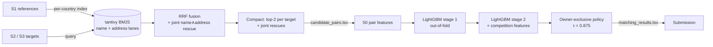

# Business Entity Resolution — Amazon ML Challenge 2026

Matching noisy business records across three independent sources, at
full scale (12.5M train records, 11.7M test records, 7.6M labeled links),
on CPU only, with no external data.

**Final public leaderboard: 0.952 macro-F0.5** (up from 0.815 for the first
release).

The biggest lesson was about validation, not modelling. The first release
scored **0.976 locally but 0.815 on the leaderboard**. Rebuilding validation
so each reference faced the same competition it faces in test brought local
scores to within 0.01 of the leaderboard. Every later gain came from that
rebuild.

---

## The problem

Every Source-1 (reference) business must be matched to all Source-2 and
Source-3 records that describe the same real-world business. A reference
can match zero, one or many records.

- **Records** have only `business_name`, `business_address` and `country`.
  They share no IDs.
- **Noise:** abbreviations (`Pvt`/`Private`, `Rd`/`Road`), legal-suffix
  changes, DBA names, typos, word reordering, landmark addresses
  (`Near SBI ATM`), missing components, and transliteration.
- **Countries:** training covers US and India. Test adds **France**, which
  has no labels at all.
- **Metric:** macro-averaged **F0.5** over Source-1 entities, which weights
  precision twice as much as recall. Singletons count: an empty prediction
  for a reference with no matches scores 1.0, and any match scores 0.0.
- **Rules:** no external lookups, APIs or geocoding. Models must be
  MIT/Apache-2.0 licensed and ≤ 8B parameters.

The full statement is in [`documents/`](documents/). The official output
validator is in [`student_resource/utils/`](student_resource/utils/).

### What the data showed

| Measured fact | Why it mattered |
|---|---|
| 2.2M train / 1.7M test references; ~10M target records per split | Pairwise matching is impossible, so retrieval comes first |
| Every target has **at most one** owner (zero reused targets across 7.6M links) | The ground truth is owner-exclusive, so decisions should be too |
| 5.6% of references are true singletons | False merges on them cost a full 1.0 each |
| Match cardinality ranges 0..11 | A single best match per reference is not enough |
| France is 15% of test references and has no training analog | Features cannot depend on country |
| Indian targets often use native script (Devanagari, Tamil, …) | Cross-script comparison is needed |
| Train S1 is 100% ASCII; test France has 73k accented addresses | Accent folding is needed |

---

## Pipeline



### 1. Candidate generation (reverse retrieval)

- **Index:** one tantivy BM25 index per country, built over the
  deduplicated Source-1 references. Each document has two term streams,
  name and address. Each stream merges character trigrams, word tokens and
  accent-folded trigrams. Accent folding touches only Latin bases, so
  Devanagari and Tamil text stays byte-identical.
- **Queries:** every S2/S3 record queries its country's index with its 16
  rarest known terms per lane (per-field document frequency).
- **Fusion:** the name and address lanes (top-8 each) are fused by
  reciprocal-rank fusion (offset 60). A **joint rescue lane**, which requires
  (rare name terms) AND (rare address terms), adds its top-2 results.
  Screening showed +4.6pp link recall for about one extra candidate per
  query.
- **Compaction:** strict reverse budget of 2 per target (exact ties expand),
  plus the joint rescues.
- **Volume on test:** 33.4M edges over 10.0M queries (3.35 per query).
- **Ceiling:** the candidate-oracle macro-F0.5 is **0.985**, so blocking
  loses 0.015.

Screened and rejected: a forward S1→target rescue lane, and an `anyascii`
transliteration lane. Both were too weak for their cost.

### 2. Features (50 in stage 1)

- **Name:** Jaro-Winkler, normalized Levenshtein, token Jaccard and
  overlap, exact and sorted-token exact, length ratio, containment,
  shared-token IDF weight, script flags.
- **Address:** the same similarity family, plus numeric-token overlap and
  missing-field flags.
- **Sibling discrimination:**
  - all digit runs, including single-digit house numbers, which affect 24%
    of French addresses
  - a **name core** with legal forms and generic words stripped, so
    *Advik Farms* and *Advik Properties* separate
  - accent-folded Jaro-Winkler
- **Cross-script:** [`translit.py`](project/src/ber/translit.py) is a
  rule-based Indic→Latin transliterator covering all nine Indic Unicode
  blocks. It reduces names to consonant skeletons, so
  `अरिहंत प्रोडक्ट्स प्राइवेट लिमिटेड` and `Arihant Products Private Limited`
  both become `arnt prdkts prvt lmtd`. This raised India W-D from 0.939 to
  0.947.
- **Retrieval context:** RRF value, rank, margin, lane BM25 scores, and
  joint-lane rank.

### 3. Two-stage LightGBM cascade

- **Stage 1:** 500 rounds, trained out-of-fold (2 folds split by
  reference). It produces an honest score for every edge.
- **Stage 2** (400 rounds) adds **competition features** built from
  stage-1 scores:
  - the target's gap to its best *other* reference
  - the rank inside the target group and the reference group
  - the count of high-scoring rivals
- **Settings:** 127 leaves, learning rate 0.05, trained on 16.0M
  dense-environment edges.
- **Gain:** stage 2 added +0.005 overall. Most of it was on singletons
  (0.944 → 0.967).

### 4. Decision policy

**Owner-exclusive:** each target goes only to its single best-scoring
reference, and only when its score is ≥ τ and beats the runner-up by a
margin γ. This mirrors the ground-truth constraint. The old export assigned
154k targets to 2+ references; the new one assigns none.

---

## The key idea: a test-faithful validation environment

The first validation cohorts scored only *focal* references and carried
**0.3–0.6 targets per catalog reference**. Test carries **5.76**. In that
sparse setting, most near-duplicate distractors were missing, so false
positives stayed hidden.

**Dense environment `W`** rebuilds each country's catalog and traffic at
test density:

- **Catalog:** every held-out reference plus background fill, sized to
  match test.
- **Traffic:** every owned target, plus *ownerless orphans* (unlinked
  targets and targets whose reference was left out). This gives
  US 5.76 targets/ref (40% ownerless) and India 5.10 (32%).
- **Scoring:** every cohort reference is scored against all test-like
  competitors.
- **Training rows:** only edges with F/B-role reference and target, which
  is 80% of all labels (the old model used 5%).
- **Selection protocol:** policies are selected on **D**, checked on **K**,
  and **A2** is a sealed one-shot audit.
- **Transfer check:** a separate 20%-scale dense environment (`Wm`) tests
  whether results carry over to a smaller catalog like France's. The frozen
  release scores K 0.9716 there, against 0.974 when re-tuned.

## Results

### Leaderboard history

| Release | Change | Public LB |
|---|---|---:|
| v5-joint | threshold tuned on sparse cohorts (local audit 0.976) | 0.815 |
| v6-safe | same model, owner-exclusive policy, stricter τ | 0.877 |
| v7 | retrained in dense env W + sibling features + stage 2, τ=0.85 | 0.947 |
| **v8_matched** | + Indic transliteration skeleton features, τ=0.875 | **0.952** |

### Dense-environment measurements

| Model / policy | W-D | W-K | US | India | Singletons |
|---|---:|---:|---:|---:|---:|
| v5 model, owner policy | 0.938 | 0.939 | 0.956 | 0.913 | 0.905 |
| dense stage 1 (46 feats) | 0.954 | 0.955 | 0.967 | 0.938 | 0.944 |
| dense stage 2, τ=0.85 | 0.957 | – | 0.969 | 0.939 | 0.981 |
| **+ transliteration, τ=0.875 (final)** | **0.960** | **0.961** | 0.969 | **0.947** | **0.986** |

### Why τ is above the W optimum

The W optimum is τ=0.707 (D 0.960). The real test set has about twice as
many edges in the uncertain score band, which means more near-duplicate
distractors. Raising τ to 0.85 cost 0.003 on W. The release that shipped
it, together with the dense retrain, moved the leaderboard from 0.877 to
0.947.

### Tried and not shipped

- **Expected-F0.5 per-reference top-k selection:** tied on D (+0.0004) but
  dropped singletons to 0.935.
- **Variant without raw BM25 features:** equally robust across scales, so
  the full feature set shipped.

### Where the remaining loss is

- **Blocking:** the candidate ceiling is 0.985.
- **India:** the weakest slice, because of transliterated native-script
  names.
- **Siblings:** businesses sharing an address with near-identical names.

---

## Repository layout

```
.
├── project/                      # main codebase
│   ├── src/ber/                  # pipeline package
│   │   ├── records.py normalize.py translit.py
│   │   ├── splits.py env.py dense.py        # identity-disjoint splits, dense env W
│   │   ├── retrieval.py candidates.py       # tantivy BM25 lanes, RRF, joint rescue
│   │   ├── features.py training.py          # pair features, LightGBM
│   │   ├── decisions.py metrics.py          # owner policy, exact macro-F0.5
│   │   ├── export.py audit.py               # TSV writers, full-edge audits
│   │   ├── stages.py pipeline.py cli.py dense_run.py
│   │   └── tests/                           # ~200 unit tests (incl. validator parity)
│   ├── experiments/              # retrieval sweeps and diagnostics
│   ├── artifacts/                # earlier model snapshots + audit reports
│   └── submission/               # packaged final submission (code + v8 models)
├── student_resource/             # official README, validator (dataset not included)
├── documents/                    # problem statement
├── master.md                     # full design / execution plan (1.7k lines)
└── docs/superpowers/plans/       # local recovery plan with measured outcomes
```

---

## Reproducing

**Requirements:**
- Python ≥ 3.13 and [uv](https://github.com/astral-sh/uv)
- About 250 GiB RAM for the full pipeline; the final run used an AWS
  g6e.8xlarge (32 vCPU, CPU only)

**Dataset:** not included. Get it from the competition and place it under
`student_resource/dataset/{train,test}/`.

```bash
cd project
uv sync
uv run pytest                                   # unit tests

DATA=../student_resource/dataset
export PYTHONPATH=src

# ingest + identity-disjoint splits
uv run python -m ber.cli ingest --dataset-dir $DATA --workers 7
uv run python -m ber.cli split --seed 7
uv run python -m ber.cli reserve-audit --fraction 0.05 --seed 13

# dense test-faithful environment W, and the test cohort
for C in W test; do
  uv run python -m ber.cli env      --cohort $C
  uv run python -m ber.cli index    --cohort $C --threads 16
  uv run python -m ber.cli dfmap    --cohort $C
  uv run python -m ber.cli retrieve --cohort $C --budget 2 --joint-k 2 --workers 14
  uv run python -m ber.cli features --cohort $C --workers 14
done

# two-stage model, policy selected on W-D
uv run python -m ber.dense_run train --cohort W --variant full --threads 14
uv run python -m ber.dense_run evalx --cohort W --variant full --update-release
# release.json now holds the W-optimal τ; the shipped releases used a stricter τ (see Results)

# score test and validate
uv run python -m ber.dense_run test --variant full --output-dir output/final
python3 ../student_resource/utils/validate_submission.py \
  --matching output/final/matching_results.tsv \
  --candidate output/final/candidate_pairs.tsv \
  --test-dir $DATA/test --check-ids
```

**Use the shipped models instead of retraining:**

1. Copy `project/submission/code/business_entity_resolution/artifacts/v8_matched/`
   to `data/models/dense/v8_matched/`.
2. Run `dense_run test --variant v8_matched`.

The release file pins the owner policy (γ=0.1, τ=0.875) and SHA-256
fingerprints for the model files.

**Operational notes:**

- **Workers:** keep retrieval and feature workers at or below ~14 on a
  248 GiB box. Each worker holds a full country index plus its
  term-frequency map, and 31 workers ran out of memory.
- **Resumable stages:** every stage can be resumed. Shard fingerprints
  bind index, traffic, df-map and runtime settings, so stale caches are
  rejected instead of mixed.
- **Wall-clock:**

  | Step | Time |
  |---|---|
  | Dense env | 85 s |
  | Index | ~80 s |
  | W retrieval (7.95M queries) | ~45 min |
  | Features | ~4–6 min |
  | Training | ~30 min |
  | Test scoring + export | ~6 min |

---

## Fair play and licensing

- No external data, APIs, geocoding or lookups were used at any stage.
- All learned components are LightGBM models trained locally on the
  supplied data. No pretrained weights were used.
- Dependencies are numpy, pyarrow, lightgbm (MIT), tantivy (MIT),
  rapidfuzz (MIT) and scipy (BSD).
- This repository's code is released under the [MIT License](LICENSE). The
  competition dataset and problem statement belong to their owners and are
  not covered by it.

## Honesty notes

- **W-D and W-K** are the selection and check cohorts.
- **τ:** 0.85 and 0.875 were picked using leaderboard feedback, as
  operating-point changes only.
- **Earlier local number:** the 0.976 "local audit" was real, but it was
  measured in the sparse environment. It is kept here as a cautionary data
  point.

## More detail

- [`project/submission/Documentation_template.md`](project/submission/Documentation_template.md) — the full methodology write-up
- [`project/README.md`](project/README.md) — the code-level README
- [`master.md`](master.md) — the original design plan, a review of the
  earlier plan, and the experiment protocol
